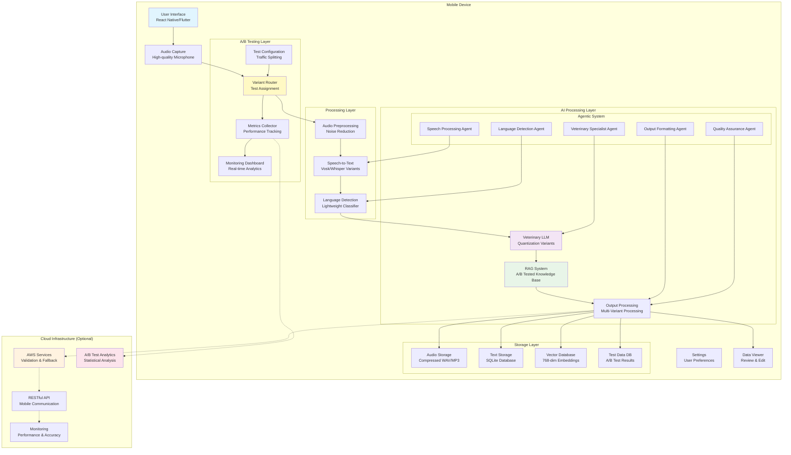

# Bilingual Veterinary Dictation System

## Project Overview
A comprehensive veterinary dictation system supporting English and Spanish with specialized localLLM capabilities for speech-to-text and veterinary vocabulary comprehension. Designed for mobile deployment with 99.999% accuracy targeting and complete offline operation.

## Key Features
- **Bilingual Support**: English and Spanish dictation with automatic language detection
- **Veterinary Specialization**: Domain-specific vocabulary and terminology processing
- **Mobile Native**: Optimized for Samsung Galaxy S25 Ultra, Google Pixel, and iPhone series
- **Offline Operation**: 100% local processing with AWS cloud fallback
- **High Accuracy**: 99.999% (five 9s) accuracy target with comprehensive audit logging
- **Agentic Architecture**: Multi-agent system with specialized components

## Technology Stack

### Core Technologies
- **Speech-to-Text**: Vosk (mobile-optimized) with INT8 quantization
- **Language Models**: Fine-tuned multilingual models with INT8/INT4 quantization
- **Mobile Framework**: React Native or Flutter with native ML integration
- **Database**: SQLite + Vector Database for embeddings
- **Cloud Integration**: AWS services for accuracy validation and fallback
- **Quantization**: 75% model size reduction via INT8/INT4 optimization

### AI/ML Components
- **Speech Processing**: Vosk-based STT (50-200MB quantized)
- **Language Detection**: Lightweight classifier (10-50MB INT4 quantized)
- **Veterinary LLM**: Fine-tuned model (100-300MB INT8 quantized)
- **RAG System**: Veterinary knowledge base (50-100MB)
- **Vector Storage**: 768-dimensional embeddings for semantic search

### Mobile Optimization
- **Target Devices**: Galaxy S25 Ultra, Pixel series, iPhone 14/15/16
- **Memory Requirements**: 8GB RAM minimum
- **Storage**: 256GB minimum, <1GB total system size
- **Processing**: ARM-based with AI acceleration (Snapdragon 8 Gen 3, A17 Pro, Tensor G3)
- **Battery Impact**: <5% per hour of use

### Performance Specifications
- **Processing Time**: <3 seconds end-to-end
- **Accuracy**: 99.999% for veterinary terminology
- **Battery Impact**: <5% per hour of use
- **Offline Capability**: 100% with AWS fallback
- **Model Size**: 75% reduction via quantization
- **Audit Logging**: Comprehensive accuracy validation

## System Architecture

### High-Level Architecture
The system follows a multi-layered architecture optimized for mobile deployment:

```
┌─────────────────────────────────────────────────────────────────┐
│                    Mobile Application Layer                     │
├─────────────────────────────────────────────────────────────────┤
│  User Interface  │  Audio Capture  │  Settings  │  Data Viewer  │
└─────────────────────────────────────────────────────────────────┘
                                │
                                ▼
┌─────────────────────────────────────────────────────────────────┐
│                    Processing Layer                             │
├─────────────────────────────────────────────────────────────────┤
│  Audio Preprocessing  │  Speech-to-Text  │  Language Detection  │
└─────────────────────────────────────────────────────────────────┘
                                │
                                ▼
┌─────────────────────────────────────────────────────────────────┐
│                    AI Processing Layer                          │
├─────────────────────────────────────────────────────────────────┤
│  Veterinary LLM  │  RAG System  │  Output Processing  │  Agents │
└─────────────────────────────────────────────────────────────────┘
                                │
                                ▼
┌─────────────────────────────────────────────────────────────────┐
│                    Data Storage Layer                           │
├─────────────────────────────────────────────────────────────────┤
│  Audio Storage  │  Text Storage  │  Vector DB  │  Metadata DB  │
└─────────────────────────────────────────────────────────────────┘
```

### Agentic System Components
- **Speech Processing Agent**: Audio preprocessing and STT conversion
- **Language Detection Agent**: Automatic language identification
- **Veterinary Specialist Agent**: Domain-specific terminology processing
- **Output Formatting Agent**: Structured data generation
- **Quality Assurance Agent**: Result validation and audit logging

### Data Flow
```
Audio Input → Preprocessing → Speech-to-Text → Language Detection → 
Veterinary Processing → RAG Enhancement → Output Generation → 
Storage → User Display
```

### System Design Diagram



## A/B Testing Framework

### Testing Objectives
- **Speech-to-Text Comparison**: Vosk vs Whisper performance evaluation
- **Model Quantization Impact**: INT8 vs INT4 vs FP16 quantization effects
- **RAG System Effectiveness**: Impact of RAG on accuracy and processing time
- **Agentic vs Single Model**: Multi-agent vs monolithic approach comparison
- **Device Optimization**: Platform-specific performance variations

### Key Metrics Measured
- **Accuracy**: Veterinary terminology recognition accuracy (target: 99.999%)
- **Processing Time**: End-to-end processing latency (target: <3 seconds)
- **Battery Impact**: Power consumption per dictation session (target: <5% per hour)
- **Memory Usage**: RAM and storage utilization optimization
- **User Satisfaction**: Subjective quality ratings and feedback
- **Error Rates**: Classification and analysis of system errors

### Test Scenarios

#### Scenario 1: Speech-to-Text Engine Comparison
- **Variant A**: Vosk (50-200MB, INT8 quantized)
- **Variant B**: Whisper Base (74MB, INT8 quantized)
- **Variant C**: Whisper Small (244MB, INT8 quantized)
- **Duration**: 2 weeks, 1000+ sessions per variant
- **Focus**: Accuracy vs performance trade-offs

#### Scenario 2: Model Quantization Impact
- **Variant A**: FP16 (baseline)
- **Variant B**: INT8 quantization
- **Variant C**: INT4 quantization
- **Duration**: 1 week, 500+ sessions per variant
- **Focus**: Model size vs accuracy trade-offs

#### Scenario 3: RAG System Effectiveness
- **Variant A**: Base model only (no RAG)
- **Variant B**: Base model + RAG system
- **Variant C**: Base model + Enhanced RAG system
- **Duration**: 2 weeks, 800+ sessions per variant
- **Focus**: Knowledge enhancement vs processing time

#### Scenario 4: Agentic vs Single Model
- **Variant A**: Single fine-tuned model
- **Variant B**: Multi-agent system (5 agents)
- **Variant C**: Hybrid approach (2-3 agents)
- **Duration**: 3 weeks, 1200+ sessions per variant
- **Focus**: Complexity vs accuracy benefits

### A/B Testing Infrastructure
- **Variant Router**: Intelligent user routing to test variants
- **Metrics Collector**: Real-time performance and behavior tracking
- **Statistical Analysis**: Automated significance testing and reporting
- **Monitoring Dashboard**: Live test monitoring with automated alerts
- **Rollback Capability**: Quick reversion on critical issues

## Deployment Architecture

### Mobile Deployment
- **Primary**: On-device processing with local models
- **Fallback**: AWS cloud processing for complex cases
- **Storage**: Local SQLite + Vector database + Test data storage
- **Updates**: Over-the-air model updates with A/B testing

### Infrastructure Components
- **Local Processing**: ARM-based mobile devices with AI acceleration
- **Cloud Integration**: AWS services for validation, fallback, and A/B test analytics
- **Security**: AES-256 encryption, biometric authentication
- **Privacy**: Complete offline operation with user data ownership
- **Testing**: Comprehensive A/B testing framework with statistical analysis

## Cost Analysis

### Development Investment
- **Phase 1 (Foundation)**: $30,000-63,000
- **Phase 2 (Optimization)**: $35,000-72,000  
- **Phase 3 (Agentic System)**: $45,000-92,000
- **Total Development**: $110,000-227,000

### Operational Costs
- **Infrastructure**: $400-1,050/month (cloud optional)
- **Maintenance**: $38,000-75,000/year
- **Team**: $500,000-640,000/year (5-person core team)

### ROI Projections
- **Break-even**: 12-18 months
- **Target Users**: 1,000+ veterinarians
- **3-Year ROI**: 400-600%
- **Subscription Model**: $50-2,000/month based on practice size

## Implementation Phases

### Phase 1: Foundation + A/B Testing Setup (2-4 weeks with sub-agents)
**Target**: Basic bilingual dictation with A/B testing infrastructure
- **Components**: Vosk STT + Language Detection + Basic Veterinary LLM + A/B Testing Framework
- **Accuracy Target**: 90-95% for veterinary terminology
- **Budget**: $20-50k/month development
- **Deliverables**: MVP with core features and A/B testing capability
- **A/B Tests**: Initial Vosk vs Whisper comparison, basic quantization testing

### Phase 2: Clinic Integration + Advanced Testing (2-3 weeks)
**Target**: Enhanced mobile optimization + comprehensive A/B testing
- **Improvements**: Mobile-specific optimizations, AWS fallback, advanced RAG, full A/B testing suite
- **Accuracy Target**: 99.999% with continuous validation and testing
- **Budget**: $20-50k/month development
- **Deliverables**: Production-ready system with comprehensive testing
- **A/B Tests**: RAG effectiveness, model quantization impact, device optimization

### Phase 3: Production Deployment + Agentic Testing (1-2 weeks)
**Target**: Multi-agent system with enterprise features and final optimization
- **Components**: Full agentic architecture with specialized components and A/B testing
- **Accuracy Target**: 99.999% with comprehensive audit trails and statistical validation
- **Budget**: $20-50k/month development
- **Deliverables**: Enterprise-grade system with data-driven optimization
- **A/B Tests**: Agentic vs single model, final performance optimization

## Key Research Findings

### ✅ Validated Assumptions
- **Free/OSS Solutions Available**: Multiple open-source options exist
- **Mobile Deployment Possible**: Achievable with optimization
- **Veterinary Vocabulary Accessible**: Good sources available
- **Bilingual Support Feasible**: English-Spanish coverage possible

### ⚠️ Challenged Assumptions
- **Agentic Approach Superior**: Higher accuracy but 3-4x cost/complexity
- **LocalLLM Sufficient**: May need hybrid local-cloud approach
- **Mobile Performance Adequate**: Significant optimization required
- **Simple Implementation**: More complex than initially assumed

### ❌ Invalidated Assumptions
- **Direct Veterinary APIs**: No comprehensive veterinary terminology APIs found
- **Easy Mobile Deployment**: Requires significant optimization
- **Low Resource Requirements**: Higher than expected resource needs

## Research Methodology
- Thought-tree process for solution exploration
- Parallel sub-agent research deployment
- Comprehensive comparison and decision matrices
- Assumption validation and hole-poking

## Directory Structure
```
research_bilingual_dictation/
├── README.md
├── project_rules.md
├── research_tasks.md
├── RESEARCH_SUMMARY.md
├── UPDATED_PLAN_SUMMARY.md
├── infrastructure/
│   ├── system_architecture.md
│   ├── control_flow_design.md
│   └── security_privacy_design.md
├── data_models/
│   └── data_model_design.md
├── vocabulary_sources/
│   ├── vet_vocabulary_research.md
│   └── veterinary_data_sources_analysis.md
├── llm_analysis/
│   ├── localLLM_analysis.md
│   ├── model_quantization_guide.md
│   └── speech_to_text_comparison.md
├── mobile_constraints/
│   ├── mobile_deployment_analysis.md
│   └── mobile_deployment_constraints.md
├── agentic_design/
│   └── agentic_system_analysis.md
└── cost_analysis/
    └── comprehensive_cost_analysis.md
```

## Next Steps

### Immediate Actions (1-2 weeks)
1. **Prototype Development**: Build basic speech-to-text prototype using Vosk
2. **Veterinary Data Collection**: Start collecting terminology from identified sources
3. **Mobile Testing**: Test basic models on target devices (iPhone 14 Pro, Galaxy S23)
4. **Expert Consultation**: Engage veterinary professionals for validation

### Short-term Goals (1-3 months)
1. **MVP Development**: Basic bilingual dictation system with core features
2. **Accuracy Testing**: Validate veterinary terminology accuracy with real data
3. **Performance Optimization**: Optimize for mobile constraints and battery life
4. **User Testing**: Test with veterinary professionals in real-world scenarios

### Long-term Vision (6-18 months)
1. **Production System**: Full-featured dictation system with agentic architecture
2. **Market Launch**: Commercial product launch with subscription model
3. **Feature Expansion**: Advanced features, integrations, and enterprise capabilities
4. **Scale**: Multi-language support, enterprise features, and market expansion
