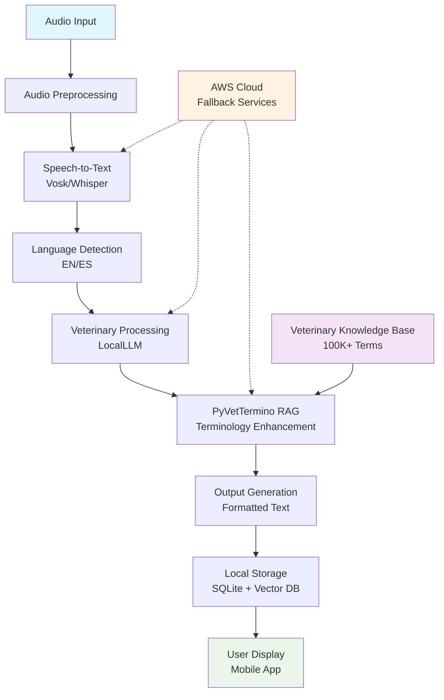

# Bilingual Veterinary Dictation System

## Project Structure

**research_bilingual_dictation/**
- [README.md](README.md)
- [ai_docs/](ai_docs/) - Rules, tasks, planning & specifications
- [research_analysis/](research_analysis/) - Research findings & validation
- [technical_analysis/](technical_analysis/) - System architecture & design analysis
- [infrastructure/](infrastructure/) - System architecture & testing frameworks
- [llm_analysis/](llm_analysis/) - Speech-to-text & model analysis
- [vocabulary_sources/](vocabulary_sources/) - Veterinary terminology research
- [mobile_constraints/](mobile_constraints/) - Mobile deployment analysis
- [data_models/](data_models/) - Data schemas & models
- [cost_analysis/](cost_analysis/) - Resource analysis

## Overview
Mobile-first veterinary dictation system with English/Spanish support, specialized localLLM capabilities, and comprehensive A/B testing framework. Includes **PyVetTermino** - a standalone veterinary terminology API/SDK.

## Key Features
- **Bilingual**: English/Spanish with automatic language detection
- **Mobile Native**: Optimized for Galaxy S25 Ultra, Pixel, iPhone series
- **Offline First**: 100% local processing with AWS fallback
- **High Accuracy**: 99.999% target for veterinary terminology
- **PyVetTermino**: Veterinary terminology API with RAG capabilities

## Technology Stack
- **STT**: Vosk (mobile-optimized) with INT8 quantization
- **LLM**: Fine-tuned multilingual models with quantization
- **Mobile**: React Native/Flutter with native ML
- **Database**: SQLite + Vector DB for embeddings
- **Cloud**: AWS services for validation/fallback

## Architecture

## PyVetTermino
Veterinary terminology API/SDK inspired by [PyMedTermino](https://pypi.org/project/PyMedTermino/). Features 100,000+ veterinary terms, multi-language support, RAG integration, and multi-platform SDKs. Open source core with commercial licensing tiers.

## A/B Testing
Comprehensive framework for testing STT engines (Vosk vs Whisper), model quantization (INT8/INT4), RAG effectiveness, and agentic vs single model approaches. Targets 99.999% accuracy with <3s processing time.

## Research Sources
- [PyMedTermino](https://pypi.org/project/PyMedTermino/) - Medical terminology library inspiration
- [Vosk](https://alphacephei.com/vosk/) - Mobile-optimized speech recognition
- [Whisper](https://github.com/openai/whisper) - OpenAI speech recognition model
- [Existing Veterinary Solutions](https://vetnotes.com, https://talkatoo.com) - Market analysis

